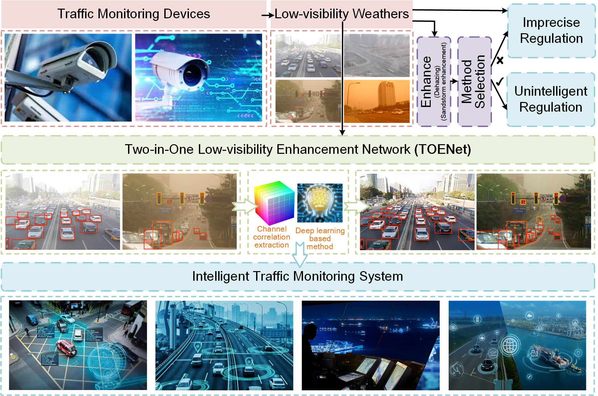
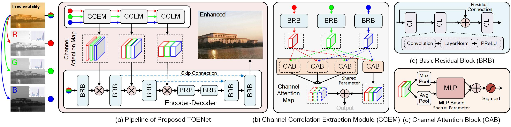

# <p align=center> [IEEE TIM] Let You See in Haze and Sandstorm: Two-in-One Low-visibility Enhancement Network</p>

<div align="center">

[](https://ieeexplore.ieee.org/abstract/document/10216344)
  


</div>

---
>**Let You See in Haze and Sandstorm: Two-in-One Low-visibility Enhancement Network**<br>  Yuan Gao, Wenyu Xu, and [Yuxu Lu<sup>*</sup>](https://scholar.google.com.hk/citations?user=XXge2_0AAAAJ&hl=zh-CN) (* indicates corresponding author) <br> 
>IEEE Transactions on Instrumentation & Measurement

> **Abstract:** *Scattering particles (such as water vapor and dust) in the atmosphere excessively absorb and scatter light, which causes the image collected by imaging sensors with low visibility, low contrast, and color shifting, etc. This limitation hinders the development of vision-driven artificial intelligence applications, such as the intelligent traffic monitoring system (ITMS). To improve imaging quality in hazy and sandstorm conditions, this paper proposes a novel two-in-one low-visibility enhancement network (termed TOENet). Specifically, we take into account the changes in the histogram distributions of the red, green, and blue channels of the hazy and sandstorm images and present a multilayer perceptron (MLP)-based channel correlation extraction module (CCEM) to learn and reconstruct the correlation between the channels of low-visibility images. The multi-scale channel attention features generated by CCEM will be embedded into the backbone (i.e., the Encoder-Decoder network) of TOENet to extract additional latent feature information from low-visibility images. TOENet can achieve both dehazing and sandstorm enhancement through a single deep network model without incurring extra computational costs. Extensive experimental results demonstrate that the proposed TOENet outperforms several state-of-the-art methods on challenging datasets. Furthermore, the running time and object detection experiments indicate the practical benefits of our method for high-level visual task under low-visibility weathers in ITMS. The source code is available at https://github.com/YuanGao-YG/TOENet.*
<hr />

## Requirement

- Python 3.7
- Pytorch 1.12.0

## Motivation


## Network Architecture


## Test
* Place the pre-training weight in the `checkpoint` folder.
* Place test low-visibility images in the `input` folder.
* Modify the weight name in the `test.py`.<br>
* Run `test.py`
* The results are saved in `output` folder.

## Citation

```
@article{gao2023,
  title={Let You See in Haze and Sandstorm: Two-in-One Low-visibility Enhancement Network},
  author={Yuan Gao, Wenyu Xu, and Yuxu Lu},
  journal={IEEE Transactions on Instrumentation & Measurement},
  volume={72},
  page={1-12},
  year={2023},
  publisher={IEEE}
}
```

## If you have any questions, please get in touch with me (yuangao24@mails.tsinghua.edu.cn).
